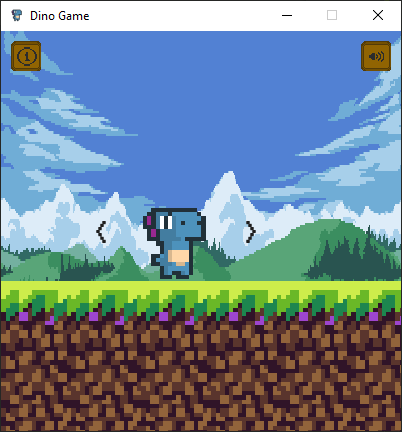
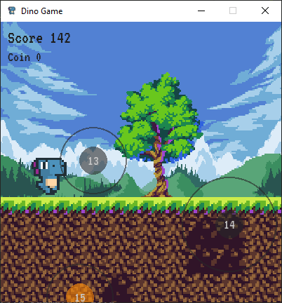
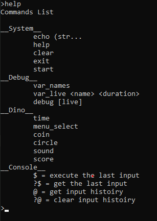

# Dino Game



## How to play ?

You need to install python 3.9 first to play the dino game.

> Download python

[Click here](https://www.python.org/downloads/) and download python to your computer.

> Install libraries

```cmd
pip install pygame pymitter
```

> Download and Start the game

Open the Powershell and enter the scripts below.

```powershell
$repos = "https://codeload.github.com/JulesG10/Dino/zip/refs/heads/master"

$download_file = (New-Object -ComObject Shell.Application).NameSpace('shell:Downloads').Self.Path + "\Dino.zip"

$download_unzip_file = $download_file.replace("Dino.zip", "Dino")

Invoke-WebRequest -Uri $repos -OutFile $download_file

Expand-Archive -LiteralPath $download_file -DestinationPath $download_unzip_file

cd $download_unzip_file
cd "Dino-master"
python dino.py
```

> In game



> Live Console

